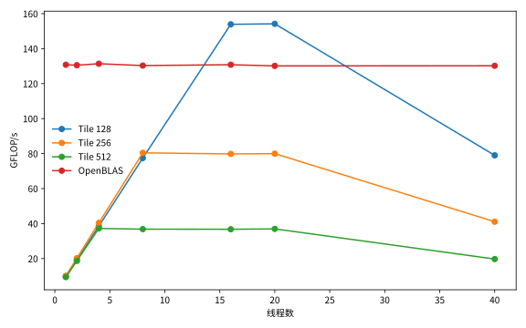
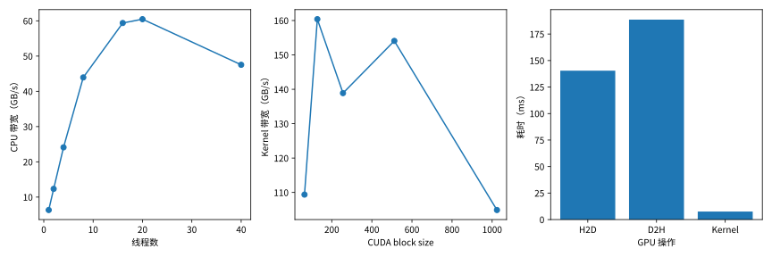
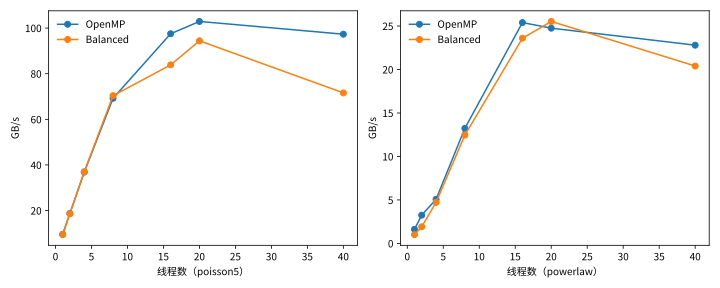

# HPC Getting Started

个人 HPC 学习项目。使用 OpenMP, OpenBLAS, CUDA 实现并测试了 GEMM, SpMV 等经典 HPC 算子。

## 视频演示（Jul 24, 2026）

https://github.com/user-attachments/assets/19f38e89-8236-4a95-9db2-4d7fe5bb5bc0

<details>
<summary><strong>测试环境</strong></summary><br>

date: Jul 24, 2026

### Hardware
Cloud instance: Aliyun ECS (KVM) ecs.gn8is.4xlarge<br>
CPU: Intel Xeon Gold 6462C, 8 vCPUs, 16 threads, up to 3.9 GHz<br>
CPU cache: L1d 385 KB, L1i 256 KB, L2 16 MB, L3 60 MB<br>
CPU arch: x86_64 (amd64), 1 NUMA node<br>
Memory: 128 GB<br>
GPU: 1 x NVIDIA L20 (Ada), 46068 MB VRAM, 350 W<br>
Storage: 40 GB NVMe, XFS<br>

### Software
Kernel: 7.0.14-201.fc44.x86_64<br>
Linux distro: Fedora 44<br>
glibc: 2.43<br>
gcc/g++: 15.2.1 20260123 (Red Hat 15.2.1-7)<br>
C++ standard: ISO C++ 23 (CPU), C++ 20 (GPU)<br>
NVIDIA driver: 610.43.02<br>
CUDA runtime: 13.3<br>
NVCC: 13.3.73<br>
OpenMP(libgomp): 16.1.1<br>
OpenBLAS: 0.3.29<br>


xmake: 3.0.6+20260117<br>
pkgconf: 2.5.1<br>

</details>

使用指南：
```shell
git clone https://github.com/loongjuanfeng/HPC-Getting-Started.git
cd HPC-Getting-Started/

# config with CUDA (requires NVIDIA CUDA toolkit)
xmake config --mode=release --with_cuda=yes
# config without CUDA
xmake config --mode=release --with_cuda=no

# build
xmake build

# list available targets
xmake show -l targets
# run a specific target
xmake run <TARGET>
# example
OMP_NUM_THREADS=8 xmake run mat_mul_openmp --size 512
```

## 测试数据

| 任务 | 性能记录（Jul 4, 2026） |
|------|---------|
| <strong>GEMM</strong><br>N = 2,048 |  |
| <strong>Vector<br>Addition</strong><br>N = 100,000,000 |  |
| <strong>SpMV</strong><br>poisson5:<br>grid width = 4,096<br>powerlaw:<br>rows = 4,194,304 |  |

<details>
<summary><strong>分析数据</strong></summary><br>

### GEMM
Tile 128 在 20 线程达到 154.21 GFLOP/s。Tile 越大，可并行任务越少；OpenBLAS 性能基本不随线程数变化，表现为单线程。

### Vector Addition
CPU 带宽在 20 线程达到峰值。CUDA block size 128 最快，但整体 GPU 操作主要耗时在数据传输。

### SpMV
规则矩阵 `poisson5` 可扩展到 20 线程；不规则矩阵 `powerlaw` 受随机访存限制，Balanced  策略仅在 20 线程略有优势。

</details>

<details>
<summary><strong>测试环境</strong></summary><br>

date: Jul 4, 2026

### Hardware
Cloud instance: Aliyun ECS (KVM) ecs.gn6i-c40g1.10xlarge<br>
CPU: Intel Xeon Platinum 8163, 40 vCPUs, 1 socket<br>
CPU arch: x86_64 (amd64)<br>
CPU ISA: AVX2, AVX-512<br>
GPU: 1 x NVIDIA Tesla T4, 15360 MiB VRAM<br>

### Software
Kernel: 7.0.14-201.fc44.x86_64<br>
Linux distro: Fedora 44<br>
NVIDIA driver: 610.43.02<br>
perf: 7.0.14-201.fc44.x86_64<br>
OpenMP: libgomp<br>
OpenBLAS: single-threaded<br>
CUDA / Nsight Systems: 13.3<br>
Build flags: `-O3 -g -fno-omit-frame-pointer`<br>

</details>

## 代码组织
```
├── source/
│   ├── core/          # common static library and utilities
│   ├── mat_mul/       # matrix multiplication
│   ├── spmv_csr/      # sparse matrix-vector multiplication
│   ├── stencil_2d/    # 2-dimensional stencil
│   └── vec_add/       # vector addition
└── xmake.lua          # build script
```

libcore:
```
├── include/
│   ├── allocator.hh  # no-initialization allocator
│   ├── config.hh     # read config from toml file (using toml++)
│   ├── log.hh        # logging wrapper for spdlog
│   ├── report.hh     # unified report class
│   └── timer.hh      # simple timer
├── allocator.cc
├── allocator_test.cc
├── config.cc
├── config_test.cc
├── report_test.cc
└── timer_test.cc
```
